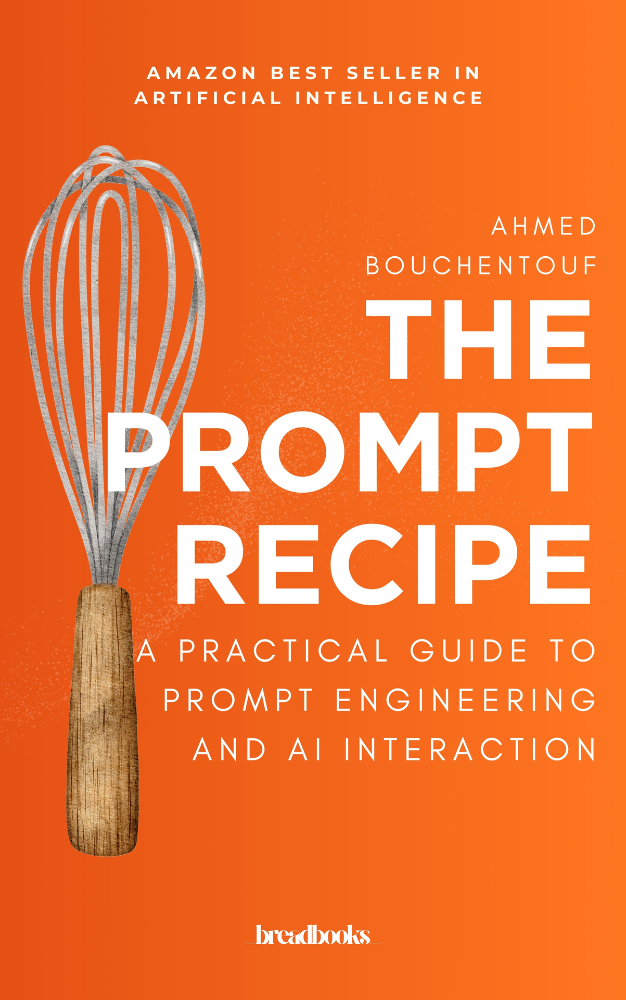

# The Prompt Recipe

### A Practical Guide to Prompt Engineering and AI Interaction

**by Ahmed Bouchentouf**

**[📖 Read online](https://YOUR-GITHUB-USERNAME.github.io/the-prompt-recipe/)** · **[⬇️ EPUB](downloads/the-prompt-recipe.epub)** · **[⬇️ PDF](downloads/the-prompt-recipe.pdf)**

---

## Why this book is free

*The Prompt Recipe* was published on Amazon in 2025, where it became a bestseller in its category and sold around **5,000 copies** before being delisted. Rather than let it disappear, I decided to release it as a free, open-access book.

You can read it, share it, and build on it — as long as it stays non-commercial. See [License](#license) below.

## About the book

Unlock the full potential of AI tools like ChatGPT — without guesswork, gimmicks, or copy-paste hacks.

If you've used generative AI, you've seen both its promise and its pitfalls. Sometimes it delivers exactly what you need. But more often, the results feel generic, vague, or off-target. The problem isn't the tool — it's how we're using it.

This book introduces a powerful idea: **a great prompt isn't a magic formula, it's a thinking strategy.** Whether you're a consultant, entrepreneur, marketer, manager, or creative professional, this book will teach you how to think and prompt like a strategist — not a gambler.

**What you'll learn:**

- Why AI doesn't "understand" your request — it predicts the next best word based on your input
- How to clarify your intention before writing anything (the most overlooked step in prompting)
- A simple and powerful structure to write prompts: **Context – Role – Objective – Format – Tone – Constraints**
- How to give better instructions, use examples, and iterate your way to better results
- How to build your own library of reusable prompts for tasks like summarizing, creating, analyzing, or brainstorming

This is not a list of "magic prompts" to memorize. It's a method you'll actually use.

## Table of contents

| | Chapter |
|---|---|
| — | [Introduction: You're Closer to the Pastry Chef Than You Think](manuscript/00-introduction.md) |
| 1 | [Inside the AI's Mind – Why Your Prompts Fail (and How to Fix It)](manuscript/01-inside-the-ais-mind.md) |
| 2 | [The First Ingredient is Clarity – Do You Really Know What You Want to Ask?](manuscript/02-the-first-ingredient-is-clarity.md) |
| 3 | [The Art of the Recipe Card – Structuring Your Prompt for Guaranteed Results](manuscript/03-the-art-of-the-recipe-card.md) |
| 4 | [The Precision of the Grammage – Why Every Word Counts in Your Prompt](manuscript/04-the-precision-of-the-grammage.md) |
| 5 | [Taste, Adjust, Repeat – The Art of Iteration and Dialogue with AI](manuscript/05-taste-adjust-repeat.md) |
| 6 | [Your Signature Recipes – Creating and Using Effective Prompt Patterns](manuscript/06-your-signature-recipes.md) |
| — | [Conclusion: The Prompt Pâtissier – Your New Strategic Advantage](manuscript/07-conclusion.md) |

## Formats

- **Web** — read it in your browser: [online version](https://YOUR-GITHUB-USERNAME.github.io/the-prompt-recipe/)
- **EPUB** — for e-readers: [`downloads/the-prompt-recipe.epub`](downloads/the-prompt-recipe.epub)
- **PDF** — print-ready layout: [`downloads/the-prompt-recipe.pdf`](downloads/the-prompt-recipe.pdf)
- **Markdown** — the full source, one file per chapter, in [`manuscript/`](manuscript/)

The EPUB and PDF are built from the Markdown source with the scripts in [`tools/`](tools/) (pure Python + headless Chrome — no LaTeX or Calibre needed).

## Contributing

Found a typo or a broken link? Pull requests are welcome. Please note that by contributing you agree that your contribution is licensed under the same CC BY-NC-SA 4.0 license.

Translations are explicitly welcome under the license (they're "adaptations" in Creative Commons terms) — if you start one, open an issue so it can be linked here.

## License

Copyright © 2025 Ahmed Bouchentouf.

This work — text and cover — is licensed under the [Creative Commons Attribution-NonCommercial-ShareAlike 4.0 International License](LICENSE) (CC BY-NC-SA 4.0). In short, you are free to:

- **Share** — copy and redistribute the book in any medium or format
- **Adapt** — remix, transform, translate, and build upon it

Under these conditions:

- **Attribution** — credit "Ahmed Bouchentouf, *The Prompt Recipe*" and link back to this repository
- **NonCommercial** — you may not use this work for commercial purposes (no selling copies, no paid courses built on the text, no ads-wrapped mirrors)
- **ShareAlike** — anything you build on it must be distributed under the same license

Commercial licensing remains possible — contact the author by opening an issue in this repository.
